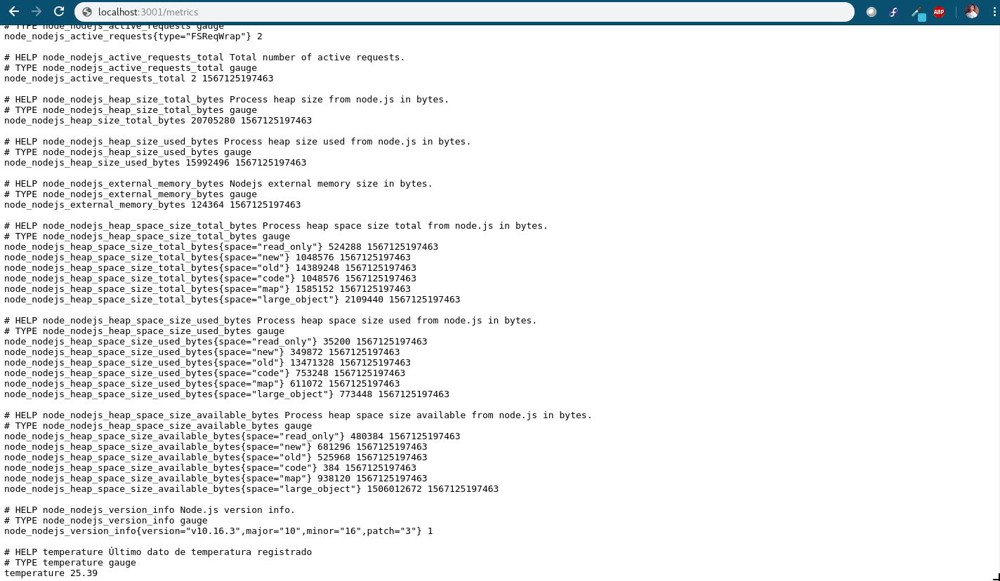
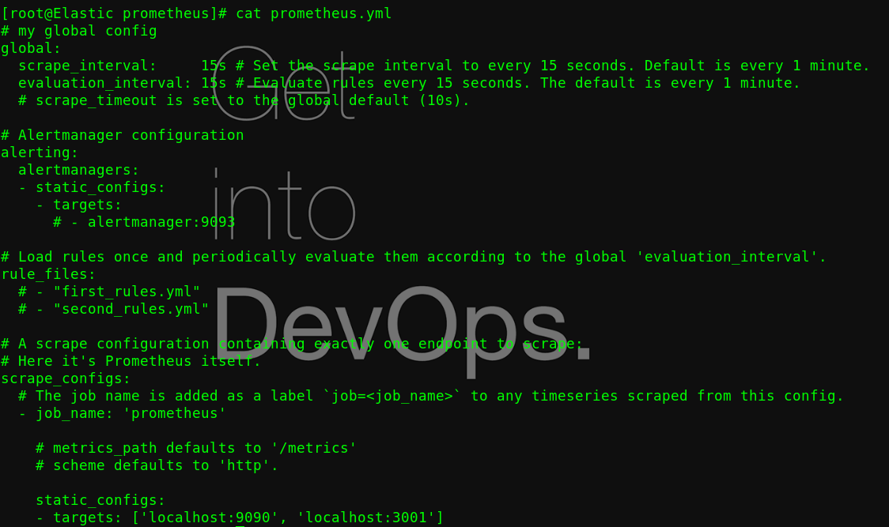
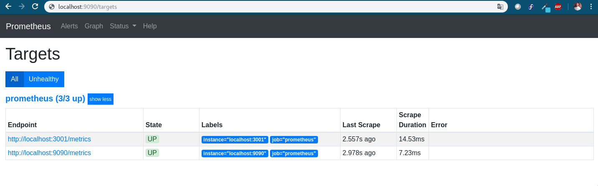
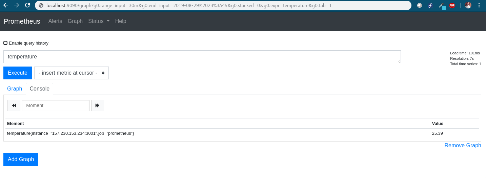
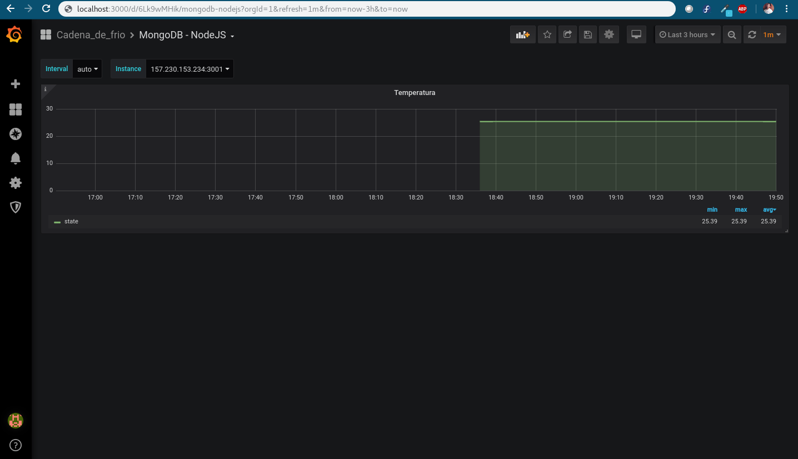

# Monitoreo de datos (MongoDB - NodeJS - Prometheus - Grafana)
* Sistema para generación de APIs.

* Los datos son obtenidos desde una base de datos Mongo utilizando NodeJS.

* Prometheus se encarga del procesamiento de los datos.

* Grafana permite el monitoreo en tiempo real de los datos

## `NodeJS`

<p align="center">

</p>

### Instalación del proyecto
```
[user@localhost]# npm install
```

### Ejecución de proyecto
```
[user@localhost]# node server
```
Validar funcionamiento `localhost:3001`

## `Prometheus`

<p align="center">

</p>

### Instalación

#### Docker
```
[user@localhost]# docker pull prom/prometheus

[user@localhost]# docker run --name prometheus -d -p 0.0.0.0:9090:9090 -v /opt/prometheus/prometheus.yml:/etc/prometheus/prometheus.yml prom/prometheus
```
Validar funcionamiento `localhost:9090`

## `Grafana`
<p align="center">

</p>

### Instalación

#### Docker
```
[user@localhost]# docker pull grafana/grafana

[user@localhost]# docker run --name grafana -d -p 3000:3000 grafana/grafana
```
Validar funcionamiento `localhost:3000`

## Proceso

### NodeJS

1. Levantar servicio de NodeJS
2. Validar información en `localhost:3001/metrics`
<p align="center">

</p>

### Prometheus

1. Agregar en archivo de configuración `prometheus.yml` la dirección de la API de NodeJS (`localhost:3001`).
<p align="center">

</p>

2. Validar que se tiene como target en la dirección `localhost:9090/target` y el estado es `UP`
<p align="center">

</p>

3. Realizar una consulta buscando `temperature`
<p align="center">

</p>

### Grafana

1. Importar dashboard en formato JSON
```
{
    "annotations": {
    },
    "editable": true,
    "gnetId": null,
    "graphTooltip": 1,
    "id": null,
    "iteration": 1541583773344,
    "links": [
    ],
    "panels": [
        {
            "aliasColors": {},
            "bars": false,
            "dashLength": 10,
            "dashes": false,
            "datasource": "Prometheus",
            "decimals": null,
            "description": "Temperatura en tiempo real consumida desde una base de datos Mongo. Proyecto de Cadena de Frío",
            "editable": true,
            "error": false,
            "fill": 2,
            "grid": {
                "leftLogBase": 1,
                "leftMax": null,
                "leftMin": 0,
                "rightLogBase": 1,
                "rightMax": null,
                "rightMin": null
            },
            "gridPos": {
                "h": 7,
                "w": 24,
                "x": 0,
                "y": 0
            },
            "height": "250px",
            "id": 25,
            "legend": {
                "alignAsTable": true,
                "avg": true,
                "current": false,
                "hideZero": true,
                "max": true,
                "min": true,
                "rightSide": false,
                "show": true,
                "sort": "avg",
                "sortDesc": true,
                "total": false,
                "values": true
            },
            "lines": true,
            "linewidth": 2,
            "links": [],
            "nullPointMode": "null",
            "percentage": false,
            "pointradius": 5,
            "points": false,
            "renderer": "flot",
            "seriesOverrides": [],
            "spaceLength": 10,
            "stack": false,
            "steppedLine": false,
            "targets": [
                {
                    "expr": "temperature{instance=~\"$host\"}",
                    "format": "time_series",
                    "hide": false,
                    "interval": "$interval",
                    "intervalFactor": 1,
                    "legendFormat": "{{state}}",
                    "refId": "J",
                    "step": 300
                }
            ],
            "thresholds": [],
            "timeFrom": null,
            "timeShift": null,
            "title": "Temperatura",
            "tooltip": {
                "msResolution": false,
                "shared": true,
                "sort": 0,
                "value_type": "cumulative"
            },
            "type": "graph",
            "x-axis": true,
            "xaxis": {
                "buckets": null,
                "mode": "time",
                "name": null,
                "show": true,
                "values": []
            },
            "y-axis": true,
            "y_formats": [
                "short",
                "short"
            ],
            "yaxes": [
                {
                    "format": "short",
                    "label": "",
                    "logBase": 1,
                    "max": null,
                    "min": 0,
                    "show": true
                },
                {
                    "format": "short",
                    "logBase": 1,
                    "max": null,
                    "min": null,
                    "show": true
                }
            ],
            "yaxis": {
                "align": false,
                "alignLevel": null
            }
        }
    ],
    "refresh": "1m",
    "schemaVersion": 16,
    "style": "dark",
    "tags": [
        "MongoDB",
        "Percona"
    ],
    "templating": {
        "list": [
            {
                "allFormat": "glob",
                "auto": true,
                "auto_count": 200,
                "auto_min": "1s",
                "current": {
                    "text": "auto",
                    "value": "$__auto_interval_interval"
                },
                "datasource": "Prometheus",
                "hide": 0,
                "includeAll": false,
                "label": "Interval",
                "multi": false,
                "multiFormat": "glob",
                "name": "interval",
                "options": [
                    {
                        "selected": true,
                        "text": "auto",
                        "value": "$__auto_interval_interval"
                    },
                    {
                        "selected": false,
                        "text": "1s",
                        "value": "1s"
                    },
                    {
                        "selected": false,
                        "text": "5s",
                        "value": "5s"
                    },
                    {
                        "selected": false,
                        "text": "1m",
                        "value": "1m"
                    },
                    {
                        "selected": false,
                        "text": "5m",
                        "value": "5m"
                    },
                    {
                        "selected": false,
                        "text": "1h",
                        "value": "1h"
                    },
                    {
                        "selected": false,
                        "text": "6h",
                        "value": "6h"
                    },
                    {
                        "selected": false,
                        "text": "1d",
                        "value": "1d"
                    }
                ],
                "query": "1s,5s,1m,5m,1h,6h,1d",
                "refresh": 2,
                "type": "interval"
            },
            {
                "allFormat": "glob",
                "allValue": null,
                "current": {},
                "datasource": "Prometheus",
                "hide": 0,
                "includeAll": false,
                "label": "Instance",
                "multi": false,
                "multiFormat": "glob",
                "name": "host",
                "options": [],
                "query": "label_values({__name__=~\"temperature\"}, instance)",
                "refresh": 1,
                "regex": "",
                "sort": 1,
                "tagValuesQuery": null,
                "tags": [],
                "tagsQuery": "",
                "type": "query",
                "useTags": false
            }
        ]
    },
    "time": {
        "from": "now-12h",
        "to": "now"
    },
    "timepicker": {
        "hidden": false,
        "now": true,
        "refresh_intervals": [
            "5s",
            "10s",
            "30s",
            "1m",
            "5m",
            "15m",
            "30m",
            "1h",
            "2h",
            "1d"
        ],
        "time_options": [
            "5m",
            "15m",
            "1h",
            "6h",
            "12h",
            "24h",
            "2d",
            "7d",
            "30d"
        ]
    },
    "timezone": "browser",
    "title": "MongoDB Overview",
    "uid": "6Lk9wMHik",
    "version": 1
}
```
La gráfica original se tomó de [Percona (MongoDB_Overview.json)](https://github.com/percona/grafana-dashboards/blob/master/dashboards/MongoDB_Overview.json)

El JSON proporcionado se adaptó al proyecto de monitoreo.

En caso de requerir más formatos &rarr; [Percona (grafana - dashboards)](https://github.com/percona/grafana-dashboards) 


2. Comprobar gráfica
<p align="center">

</p>

